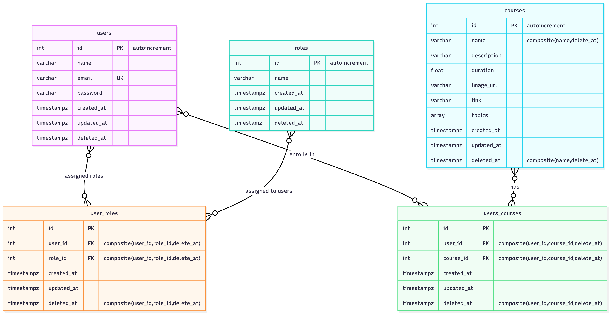

# Entity–Relationship (E-R) Diagram

---

## Overview

The **Entity–Relationship Diagram (ERD)** represents the logical structure of the ELMS database.  
It defines the entities, their attributes, and the relationships among them to ensure **data integrity**, **consistency**, and **efficient querying**.

This design supports features such as:
- User authentication and role-based access
- Course enrollment and tracking

---

## Key Entities and Attributes

###  **Users**
| Field | Type | Key | Description |
|--------|------|-----|-------------|
| `id` | int | PK | Unique identifier for each user |
| `name` | varchar | - | User’s full name |
| `email` | varchar | UK | Unique email used for login |
| `password` | varchar | - | Encrypted user password |
| `created_at` | timestamp | - | Account creation timestamp |
| `updated_at` | timestamp | - | Last update timestamp |
| `deleted_at` | timestamp | - | Soft delete indicator |

---

### **Roles**
| Field | Type | Key | Description |
|--------|------|-----|-------------|
| `id` | int | PK | Unique role identifier |
| `name` | varchar | - | Role name (`Admin`, `User`) |
| `created_at` | timestamp | - | Role creation time |
| `updated_at` | timestamp | - | Last updated time |
| `deleted_at` | timestamp | - | Soft delete indicator |

---

### **User_Roles**
| Field | Type | Key | Description |
|--------|------|-----|-------------|
| `id` | int | PK | Unique mapping ID |
| `user_id` | int | FK | Linked to Users table |
| `role_id` | int | FK | Linked to Roles table |
| `created_at` | timestamp | - | Mapping creation time |
| `updated_at` | timestamp | - | Mapping update time |
| `deleted_at` | timestamp | - | Soft delete indicator |

> **Relationship:** Many-to-Many between `Users` and `Roles`  
> (A user can have multiple roles; a role can belong to many users.)

---

### **Courses**
| Field | Type | Key | Description |
|--------|------|-----|-------------|
| `id` | int | PK | Unique course identifier |
| `name` | varchar | Index | Course name |
| `description` | int | - | Course details |
| `duration` | float | - | Duration in hours |
| `image_url` | varchar | - | Image for course display |
| `link` | varchar | - | Link to course content |
| `topics` | text[]| - | List of included topics |
| `created_at` | timestamp | - | Course creation time |
| `updated_at` | timestamp | - | Last update time |
| `deleted_at` | timestamp | - | Soft delete indicator |

---

###  **Users_Courses**
| Field | Type | Key | Description |
|--------|------|-----|-------------|
| `id` | int | PK | Record ID |
| `user_id` | int | FK | Linked to Users |
| `course_id` | int | FK | Linked to Courses |
| `created_at` | timestamp | - | Enrollment creation time |
| `updated_at` | timestamp | - | Enrollment update time |
| `deleted_at` | timestamp | - | Soft delete indicator |

> **Unique Composite Indexing:** (`user_id`, `course_id`,`delete_at`)  
> **Unique Composite Indexing:** (`name`, `delete_at`)  

---

---

