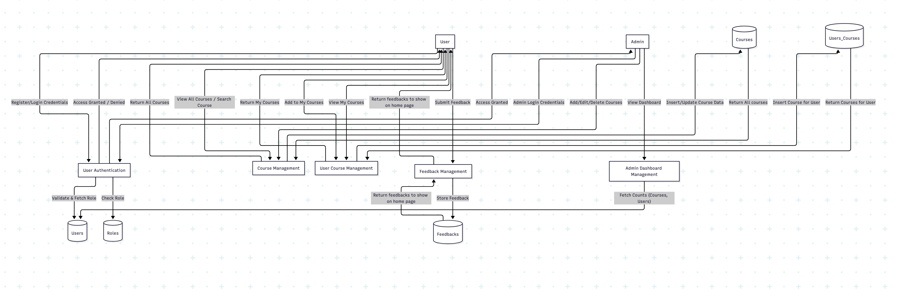

#  Data Flow Diagram (DFD)

The **Data Flow Diagram (DFD)** illustrates how data moves through the **E-Learning Management System (ELMS)** — from users and admins to backend processes and database entities.  
It visually represents the interaction between **external entities**, **processes**, and **data stores**, helping to understand how the system functions as a whole.

---

##  Level 0 – Context Diagram

At the highest level, the ELMS consists of two main external entities:

- **User:** Learns, enrolls in courses, and provides feedback.  
- **Admin:** Manages users, courses, and monitors system activity.

Both interact with the system’s central processes through a secure authentication mechanism.

---

##  Level 1 – Detailed Data Flow

---

##  Explanation of Each Component

###  **External Entities**
| Entity | Description |
|---------|--------------|
| **User** | The learner who registers, logs in, enrolls in courses, and provides feedback. |
| **Admin** | The system administrator who manages courses, monitors feedback, and oversees users through the dashboard. |

---

###  **Processes**
| Process | Description |
|----------|--------------|
| **P1 – User Authentication** | Handles user and admin login/registration. Validates credentials and fetches role-based access data from the database. |
| **P2 – Course Management** | Allows admins to create, update, or delete courses, and enables users to view or search available courses. |
| **P3 – User Course Management** | Manages course enrollment. Tracks which users are enrolled in which courses. |
| **P4 – Feedback Management** | Stores and retrieves user feedback for specific courses. |
| **P5 – Admin Dashboard** | Displays analytics like total users, courses for the admin panel. |

---

###  **Data Stores**
| Data Store | Description |
|-------------|--------------|
| **D1 – Users** | Contains all registered users’ information (name, email, password, etc.). |
| **D2 – Roles** | Stores role types such as `Admin`, `Student`, etc. |
| **D3 – Courses** | Holds course details like title, description, and duration. |
| **D4 – Users_Courses** | Maps users to their enrolled courses (many-to-many relationship). |
| **D5 – Feedbacks** | Contains user-submitted feedback messages for courses. |
| **D6 – User_Roles** | Links users to their assigned roles for role-based access control. |

---

##  Data Flow Summary

1. The **User** or **Admin** logs in via the Authentication process.  
2. The system validates credentials and fetches role-based details.  
3. The **Admin** can manage courses and view statistics.  
4. The **User** can browse courses, enroll, and give feedback.  
5. All actions update or fetch data from corresponding data stores.  
6. The **Dashboard** provides summarized data to the Admin.

---

##  Conclusion

The Data Flow Diagram for ELMS helps visualize the interaction between **users**, **admins**, and the **system’s backend processes**.  
It ensures a clear understanding of how data is handled securely, efficiently, and accurately throughout the application lifecycle.
