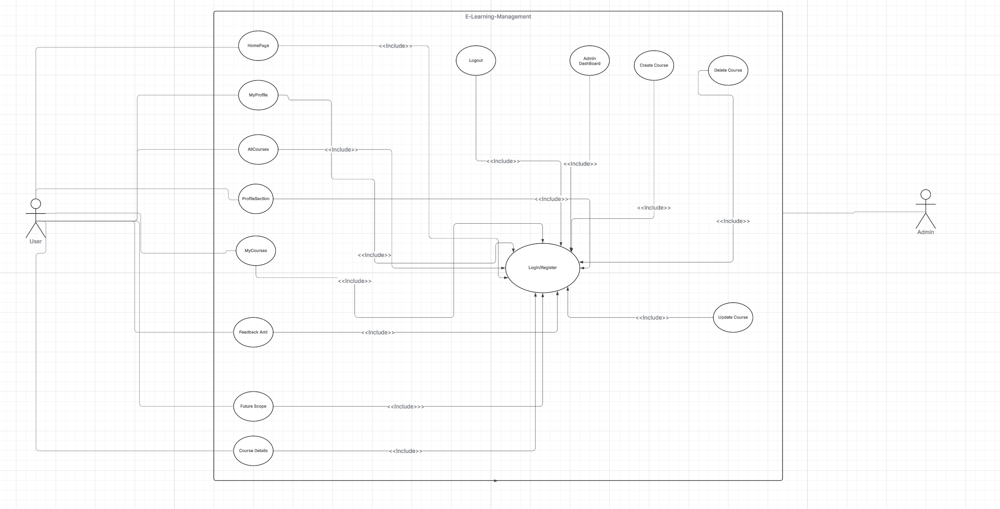

##  Use Case Diagram

The **Use Case Diagram** visually represents how different actors (users and administrators) interact with the **E-Learning Management System (ELMS)**.  
It helps in understanding the system’s functionality from the user's perspective — what actions they can perform and how each process is connected.

---

###  Actors:
- **User:** Can register, log in, browse courses, manage enrolled courses, and provide feedback.  
- **Admin:** Manages courses, monitors user activity, and maintains overall system data.

---

###  Major Use Cases:
- **Authentication:** Handles user login and registration.
- **Course Management:** Allows updating, and deleting courses (admin) and viewing or enrolling (user).
- **Feedback System:** Users can share feedback for improvement.
- **Profile & Dashboard:** Users can view/edit their profiles, while admins can monitor key statistics.

---

###  Diagram:

---

The diagram above provides a **high-level overview** of the system interactions, making it easier to identify the **roles**, **process flow**, and **system boundaries** in the application.

